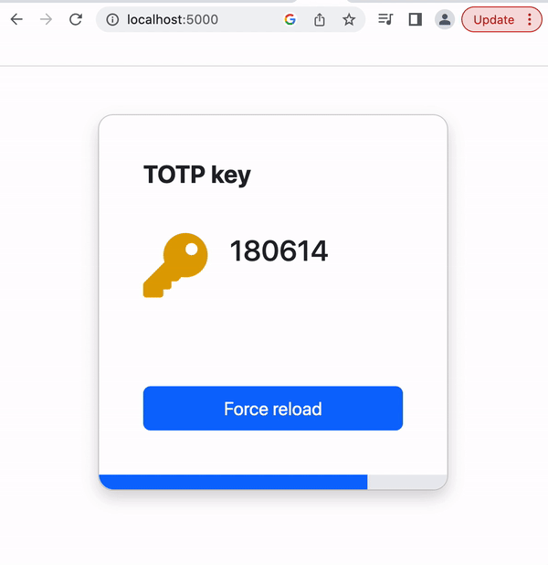
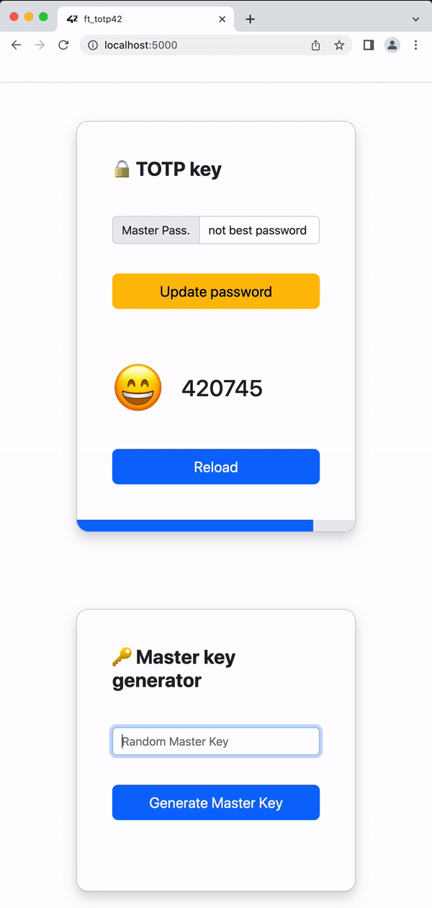
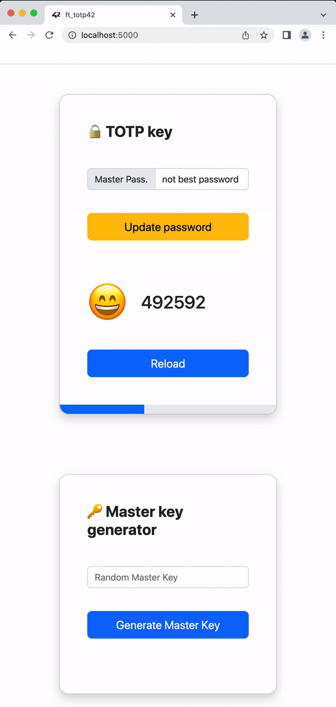
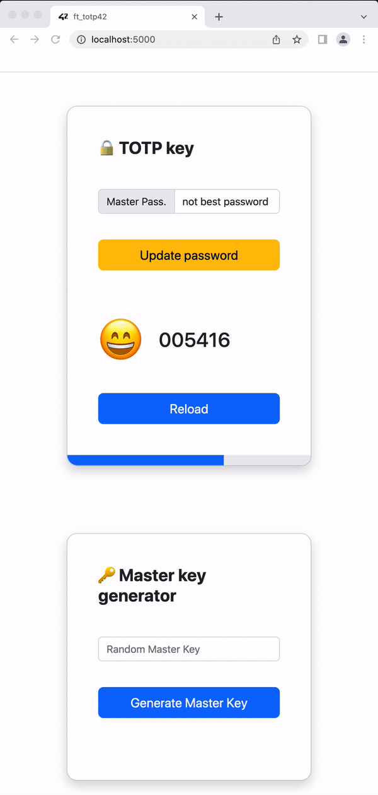

# OTP Web

# Get started
You can deploy this project in Virtualenv or Docker

## Virtualenv

```bash
python -m venv venv
(Windows) venv/Scripts/activate
(Mac) . venv/bin/activate
python -m pip install -r requirements.txt
flask run
```

## Docker

During docker image creation, some tests are passed (see **Dockerfile**)

```bash
docker-compose up
```



## Check your TOTP




## Provide a valid master key to get your TOTP




## Update master key with the strongest one!




# Development

## Debug

```bash
python -m debugpy --listen 5678 --wait-for-client -m utils.ft_otp -t keys/key.txt
```

## Tests

```bash
pytest
 pytest
# ========================================= test session starts ===================================
# platform darwin -- Python 3.7.4, pytest-7.3.1, pluggy-1.0.0
# rootdir: /Users/iocio-zu/Desktop/totp
# collected 17 # items                                                                                                                                          
# tests/test_aes_util.py ......                                                              [ 35%]
# tests/test_ft_otp.py ...........                                                           [100%]
# ========================================= 17 passed in 0.07s =====================================
```

## Static linter and autofixing

```bash
black .
ruff check . --fix
```

## Some commands

```bash
# Save hex key
echo -n "4c6f72656d20497073756d2065732073696d706c656d656e746520656c207465" > keys/key.hex
python -m utils.ft_otp -g keys/key.hex
python -m utils.ft_otp -k keys/ft_otp.key

# Save plain text key
echo -n "NEVER GONNA GIVE YOU UP" > keys/key.txt
python -m utils.ft_otp -t keys/key.txt
python -m utils.ft_otp -k keys/ft_otp.key

# Generate temporary key
python -m utils.ft_otp -k keys/ft_otp.key

# Unix cmd to convert plain text into hex
xxd -p keys/key.txt > keys/key.hex
```

## Oathtool

```bash
watch -n 2 oathtool --totp 4c6f72656d20497073756d2065732073696d706c656d656e746520656c207465 -v

oathtool –totp $(cat key.hex)
```

## Bonus

La evaluación de los bonus se hará **SI Y SOLO SI** la parte obligatoria es **PERFECTA**.
De lo contrario, los bonus serán totalmente **IGNORADOS**.
Puedes mejorar tu proyecto con las siguientes características:

* Permitir escoger la contraseña de cifrado de la clave maestra ft_otp.key y solicitarla cada vez que se genere una contraseña temporal nueva.

* Desarrollar un cliente que genere la contraseña maestra y valide los resultados con una interfaz gráfica.

* Cualquier otra característica que consideres útil. Tus compañeros juzgarán si lo es realmente.

## Documentation

[ft_totp pdf](docs/es.subject.pdf)
